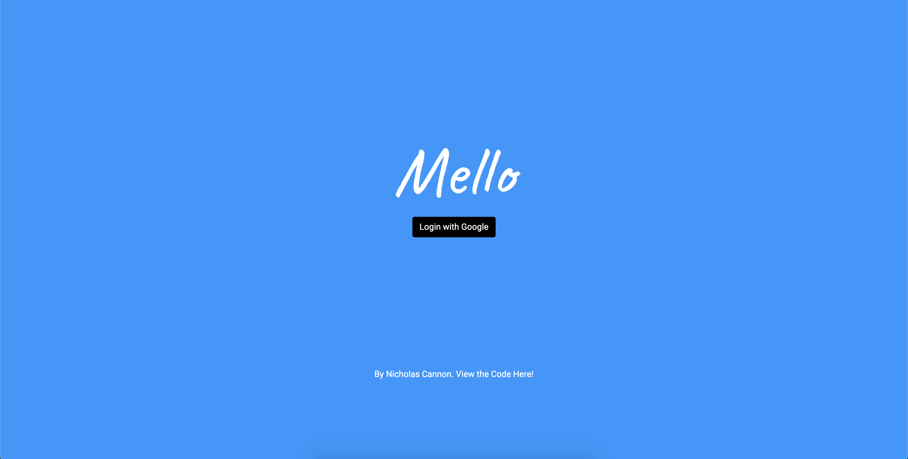
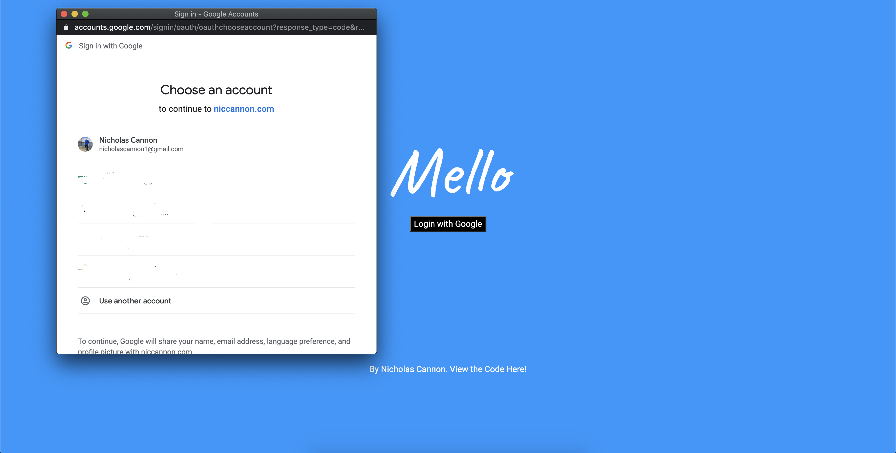
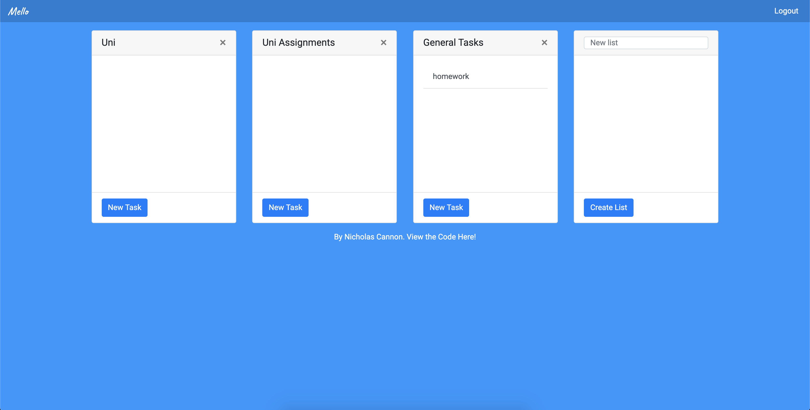
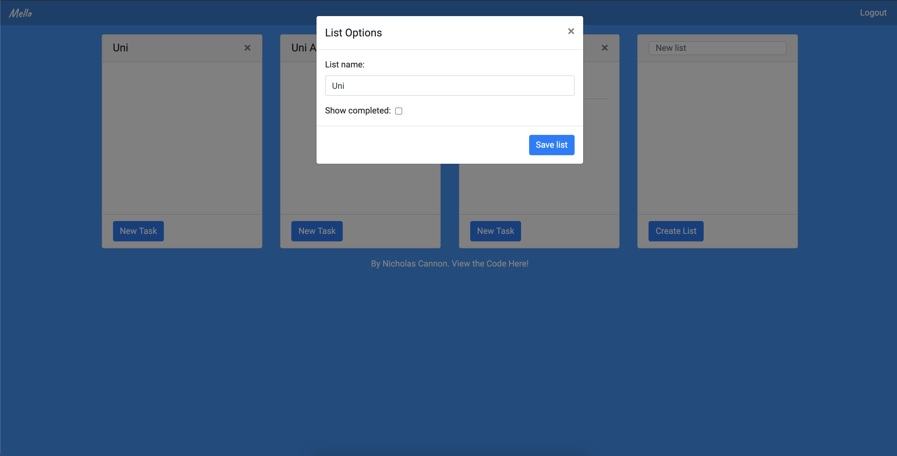
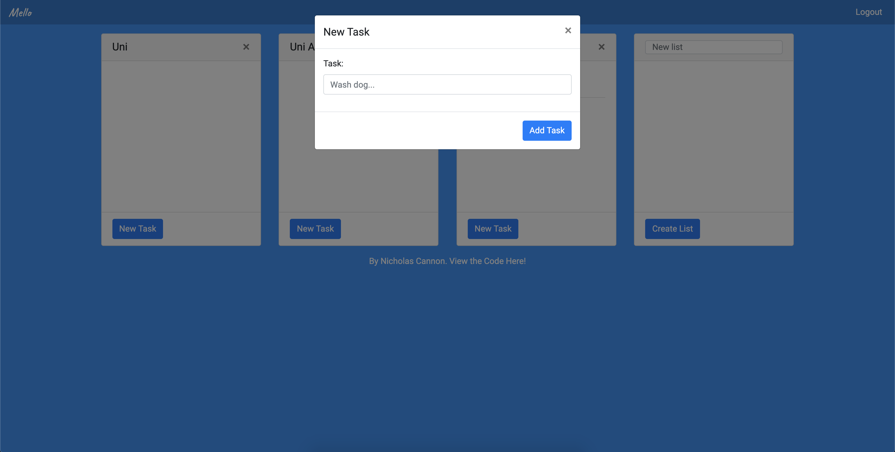
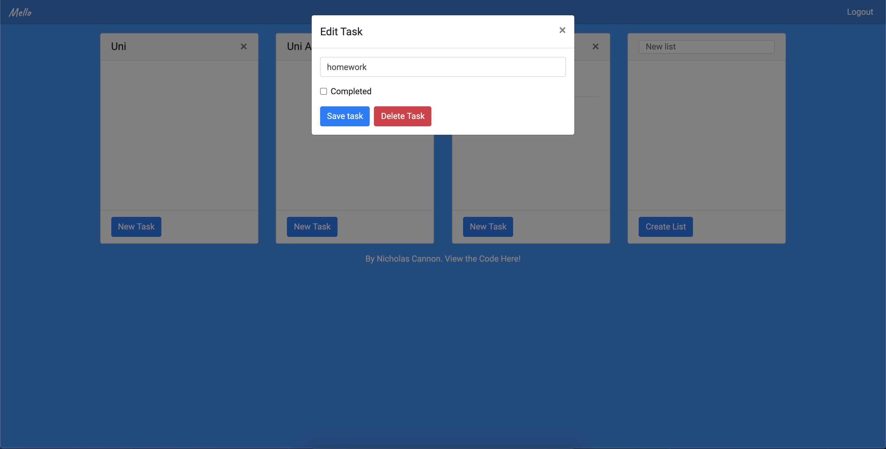

# Mello: a simple Trello clone

**Goals**

- Build a web application using Google OAuth
- Clone the basic features of Trello (multiple named todo lists)
- Create a CI/CD deployment with docker and docker-compose

## The Basics

- OAuth with Google!

- Create multiple lists

- Edit list settings

- Add tasks

- Edit / Delete tasks

